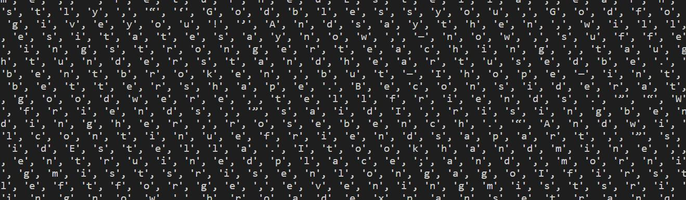
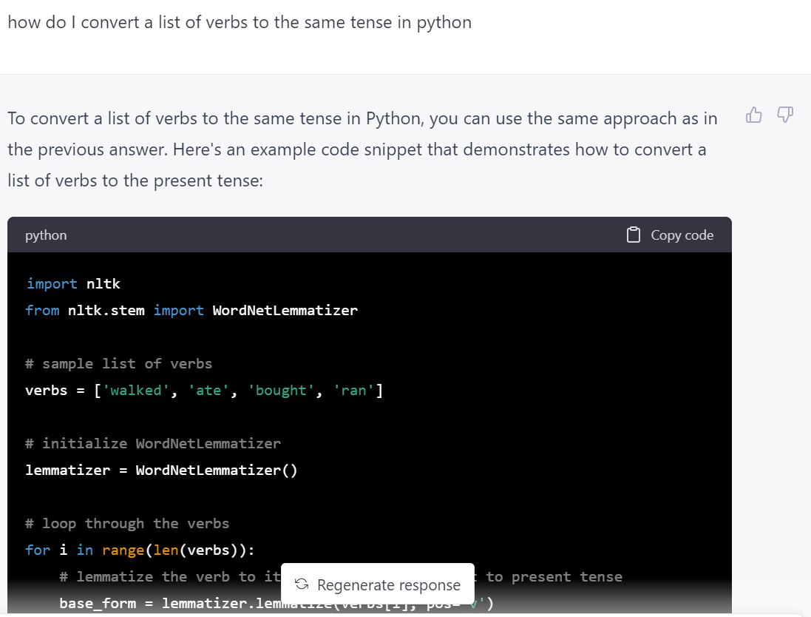
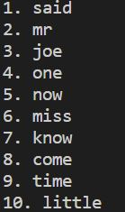
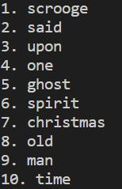
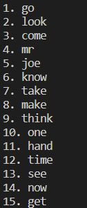
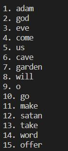

# Text-Analysis-Project
 
Please read the [instructions](instructions.md).

## Project Overview
For this project, I chose to use the Project Gutenburg data source to retrieve a plain text utf-8 file of Great Expectations by Charles Dickens because this is one of the most famous book in the American Curriculum. I also decided to use a book because I figured that I could apply what I have learned in the previous exercise on this and could be more creative with it. My main goal in this project is to see if the 10 most frequent words of a book can provide the themes and tone of a book's content. I want to remove common words and really only keep substance words in there. Some of these words include "to, and, a, etc." 

## Implementation
In order to implement this project, there are a couple major step groups. These groups include retrieving and reading the data source, stripping the data source to gain better results, utilizing the stripped data and counting and sorting the frequency of each word. Ultimately, this should return the list of most used words in the text. A large part of my focus in the beginning stages of implementation was figuring out what I wanted to strip. Based off of books in general, there are a lot of stopwords that are essential in grammatically correct sentences, but it wouldn't provide me any information on the context of the book. Since I was using the Project Gutenburg data sources, I also realized that each data text had headings and endings filled with information about Project Gutenburg. I had to remove these as well because they can skew my results with content from these headings/ endings. 

During my strippings, I really struggled with changing from string to list and figuring out how to make a list of the words in the text and not the letters of the text. Here's a picture of me failing terribly and returned all the letters of the text and not the words:
 
Utilizing .strip helped me fix this problem. Furthermore, throughout my implementation process, I was constantly testing my code with different text as well. By the end of the implementation, I was trying to improve my code by stripping away more words or fixing the tense of the words. This was where I utilized ChatGBT the most. ChatGBT helped me navigate how to change the tense of each word. I wouldn't have known to use NLTK if it did not suggest it. Here's an image of ChatGBT helping me: 

## Results
Through this project, I was able to generate a list of the most frequently used words of a given text. My code can be used by any UTF-8 file from the Gutenberg Project database with a couple minor tweeks. (The starting and ending phases of the Gutenberg headers because I noticed that they differ between each book.) Based off of my final results, my results differed widely. For example, books with a strong theme, such as the Christmas Carol by Charles Dickens or Adam and Eve By Rutherford Platt, the generated words did give a good amount of context and the general theme and tone of the book. However, advanced literature that includes more metaphors and analysis, such as The Great Expectations by Charles Dickens, did not truly summarize the book well. Below are the images of the generated results. 

 ( &nbsp; )     

Based on the results, I quickly noticed the common word that was displayed in all three results: "said." This word can easily accumulate if there is dialogue in the book. And "saying" doesn't really give me context about the book, so I decided to remove this word by including it in the stopwords.txt file. Another word that I chose to remove is "chapter." In Adam and Eve, there were many chapters and it showed in the results. Since the word "chapter" is used more as a title rather than adding value to the story, I removed it. The first book that I analyzed was Great Expectations by Charles Dickens. The 10 words proved to not have much an obvious connection or them. I contemplated whether or not to exclude "mr" and "miss" because these are titles to address people, but I decided to keep them because it shows that this book talks in a proper tone, which is true. When I tried the code on Adam and Eve, I found that of the 10 words 2 of them are the same, but with different tense. This gave me the idea to strip away the tenses in the text. Overall, I decided to return more words because 10 words didn't give me enough context of each book. These are the after results with the self critiques: 

## Reflection
From a process point of view, I'm really glad to been able to strip the words that I wanted to strip. This exercises have definitely allowed me to understand strings, lists, and dictionaries in a deeper level because of the many times that I was switching between the 3. However, I was not able to fully reach my goal of the project which was to find the general theme of the book from the most frequently used words through this project. Some results were decent, while others lacked substance. I don't think my project was properly scoped. It made sense to combine the 2 initially, but it proved to be really hard to find the connections that I wanted. I think my testing plan was decent. My plan for this project was to run the code through multiple data sources to make sure it was applicable throughout all books. Unfortunately, I found it to not be the most applicable. I also planned to test and tweak the code throughout the process to respond to the results. I did struggle a bit of structure of the code. Specifically, my remove gutenburg header function didn't seem to work when I switched the book, so I ended up calling it from the main function. I am sure there is a more efficient way to call this, but I couldn't figure it out. 

ChatGBT was quite helpful throughout my process. One of the biggest support that it provided was helping me find the connection between the most frequent words in a book and its themes. It definitely guided me on what words I should and shouldn't remove. If I could redo this project, I would love to look into NLTK more. I think there's a lot of functions in that that may help me improve my list of words, such as finding symomns. 
